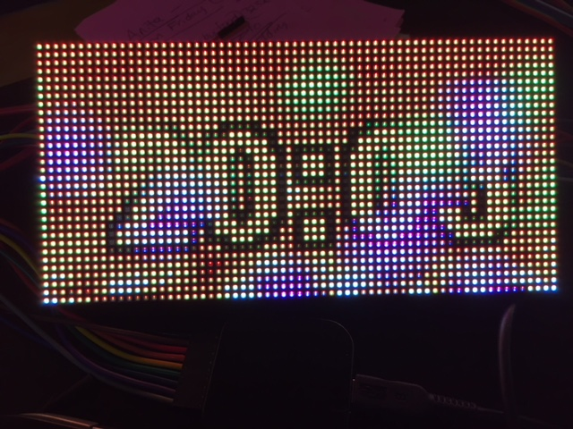

# I2S_parallel_example_drive_a_64x32_display
I2S parallel example drive a 64x32 RGB display. 

# Read more about this Network ( JINX! ) example 
https://esp32.com/viewtopic.php?f=17&t=3188&start=10#p15146

# Taken from the origin Post (wobblyboots):

Taking Sprite_tm's work and adding extra colour(s).
// to do : insert pictures

Jinx is a ... well it's a little hard to describe. It's a LED performance application that allows you to send fun graphics to LED and other lighting devices. All the processing is done on a PC and then it sends frames to the device.

It can talk a few protocols, of which I've picked TPM.net since this is over IP and the simplest one.

I took Sprite_tm's app and hacked in receiving tpm.net frame reception, resulting in this:

// to do:
insert animation

It doesn't look too bad at all, even through this dodgy GIF conversion from iphone video. In real life, the colours are lovely.

# Some issues:

- Dropped packets hurt it of course- this is on my home wifi network, so can't imagine why there would be too many dropped UDP packets, but there are. Certainly the esp32 handles it better with fewer packets in a row, but I would be delighted to find that I've done UDP reception wrong and is easily fixed
- Even without the dropped frames, the regulation in making frames regular isn't great, so sometimes it's fine, sometimes it's not, again, I've done no work on making this better
- The frame display mechanism has a few issues - the left most (zero) pixel seems to be wrapped from the right hand side of the display (should be easy to fix) and there are some ghosting issues especially with green (not sure where this is coming from)

Certainly needs some work but shows the capabilities of the chip and a cheap display.

# For Jinx:

- Choose File | Open, choose the demo.jnx. Do this first, since the display settings are embedded in here.
- Choose Setup | Matrix Options , enter 64 x 32, and 1 and 1 for pixel step and space
- In Setup | Output Devices, choose add, and enter tpm-net, the IP address of your esp32, channels = 6144 (which is 64x32x3) and Chan/Block of 1024. This determines how many UDP packets per frame are sent, so if you say "1" then you'll get 6144 UDP packets per frame. Seems to max out at packet size of 1500 (actually it lets you put in any value but then just fails to send packets), which is a shame since I'd hoped the wifi max of 1536 would mean one less packet per frame
- Now go to Setup | Output Patch, make sure red, green, blue are 0, 1 2, and hit Fast Patch. Enter 64 x 32, Linewise Top Left, RGB and 0, and OK. All the "pixels" in this window should show green.
- In View menu, turn on Scene list and Chase list.
- Find the Chase list window and press Play.

Finally, from the Setup menu, turn on Start Output.

Jinx should start sending packets to your ESP32 and you'll get pretty pictures. You can even set it up to take live video from your webcam or the actual screen output and shove it on the display.

// to do: 
insert link to JINX!

# Be aware that this is preliminary work and it comes with no guarantees or support from Espressif.

  
 
